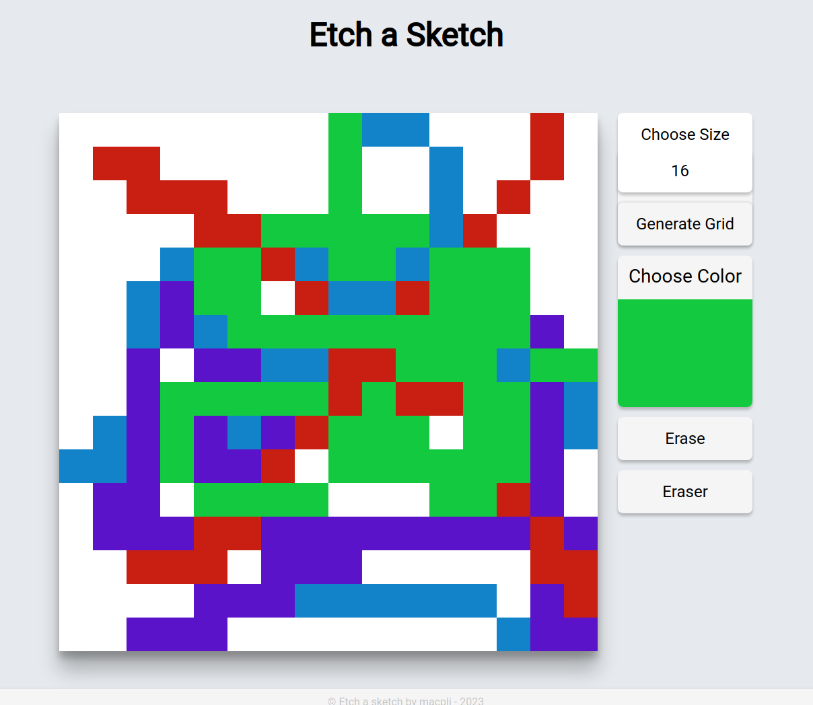

# etch-a-sketch
<h1>Demo 
</img> 

## Description
Well-known Etch A Sketch drawing toy replicated in JavaScript.

# Rules:
- Choose a color
- Hoover over the board to paint
- Choose eraser to erase colored cells
- Choose erase to erase the canvas
- Choose the size of the canvas (1-100 x by x)
- Based on real life game:  Etch A Sketch

# State:
Work in progress
